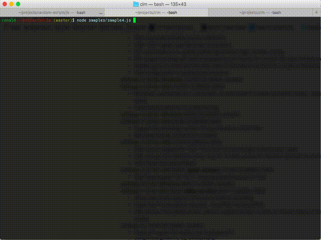

# clm
command-line-magic

A command line utility written in Node.js intended for producing simple animations. CML includes a simple command line package you can use to create simple text animations in your terminal. You also have access to the Symbol and Animation classes which allows you to produce custom animations of your own. 	

# Installation :

```
npm install clm
```

# Try it out :

```
node clm/cli -m "type your message here"
```

# Usage :




## Via the command line : 

The CLM command line utility gives you some canned animations you can produce right away such as the marquee animation. 

```
  Usage: cli [options]

  Options:

    -h, --help             output usage information
    -m, --message [value]  String to animate as a message
    -s, --speed <n>        Speed of your animation
    -d, --duration <n>     Duration of your animation in milliseconds
    -x, --xOffset <n>      X-offset for your symbol per frame
    -y, --yOffset <n>      Y-offset for your symbol per frame
```

## Via Node.js : 

```javascript
const Clm = require('clm');
const c = new Clm();

c
    .setFrameRate(50)
    .setDuration(10000)

    .setString('i love')
    .setTopLeft()
    .setXOffset(1)

    .setString('eating')
    .setStartingPosition(0, 11)
    .setXOffset(1)

    .setString('rice')
    .setStartingPosition(0, 22)
    .setXOffset(1)

    .setString('and drinking')
    .setStartingPosition(0, 33)
    .setXOffset(1)

    .setString('juice')
    .setStartingPosition(0, 44)
    .setXOffset(1)

    .go();
```


## Create custom animations : 

Take advantage of the full api and produce your own custom animations :

```
	const Animation = require('./clm/lib/animation');
	const Symbol = require('./clm/lib/Symbol');

    var a = new Animation();
    var s = new Symbol();

    s.registerString(text);
    s.setAsMarquee();
    a.addSymbol('key', s);
    a.start();
```


